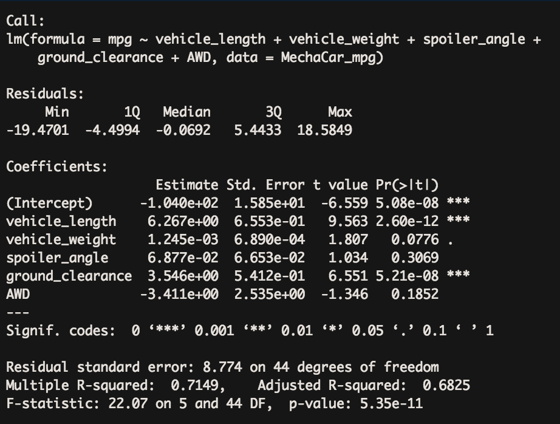

# MechaCar_Statistical_Analysis

### Linear Regression to Predict MPG

* Which variables/coefficients provided a non-random amount of variance to the mpg values in the dataset?

The variables for vehicle length and ground clearance provided a non-random amount of variance. The high p-value indicated that other factors contributed to the variance.

* Is the slope of the linear model considered to be zero? Why or why not?

No, the slope is not considered to be zero. A near zero slope indicates that some of the independent variables have an impact on the dependent variable, which is not the case here.

* Does this linear model predict mpg of MechaCar prototypes effectively? Why or why not?

Yes, as the r-squared value of 0.7149 indicates 71% of the instances would predict the correct mpg.

